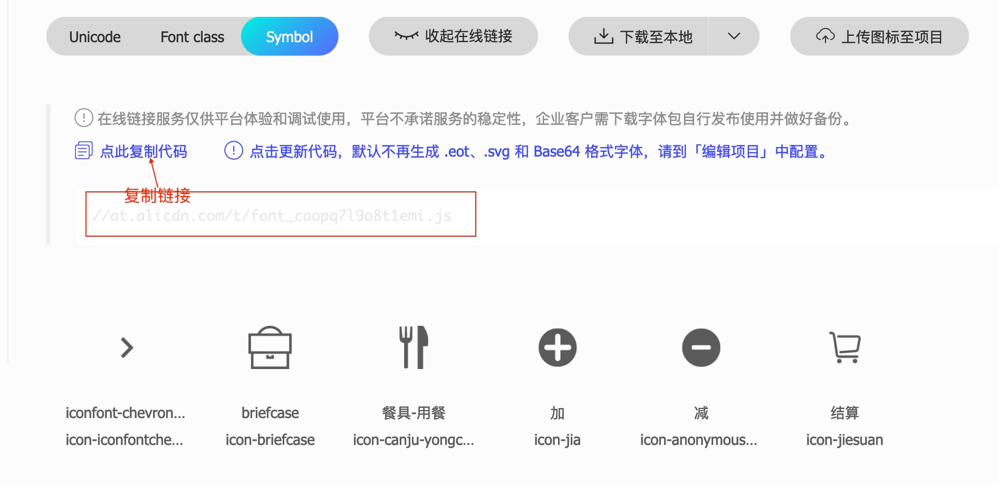

[](https://github.com/axetroy/iconfont-componentized/actions)
[](https://996.icu)
[](https://github.com/996icu/996.ICU/blob/master/LICENSE)

### IconFont Componentized

IconFont Componentized 是一系列工具，用于生成 IconFont 组件用于各种框架/环境中。

### 支持生成的框架/环境

-   [React](packages/gen-react/__tests__/output.spec.1/)
-   [Taro-React](packages/gen-taro-react/__tests__/output.spec.1/)
-   [Vue](packages/gen-vue/__tests__/output.spec.1/)
-   [WebComponent](packages/gen-web-component/__tests__/output.spec.1/)
-   [DOM](packages/gen-dom/__tests__/output.spec.1/)
-   [SVG](packages/gen-svg/__tests__/output.spec.1/)

#### 使用方法

1. 安装依赖

```bash
npm install @iconfont-componentized/cli -D
```

2. 生成配置文件 `iconfont-componentized.json`

```json
{
    "$schema": "https://raw.githubusercontent.com/axetroy/iconfont-componentized/main/packages/share/src/config/schema.json",
    "defaultSize": 32,
    "classNamePrefix": "icon-font"
}
```

3. 获取 IconFont 的地址



4. 添加生成脚本到 `package.json`

```json
   "script": {
       "iconfont": "iconfont-componentized --url https://at.alicdn.com/t/font_caopq7l9o8t1emi.js --config iconfont-componentized.json"
   }
```

5. 生成组件

```bash
npm run iconfont
```

### 参与贡献

```bash
git clone https://github.com/axetroy/iconfont-componentized
cd iconfont-componentized
pnpm install
pnpm test
```

### 开源许可

[ANTI-996 LICENSE](LICENSE)
